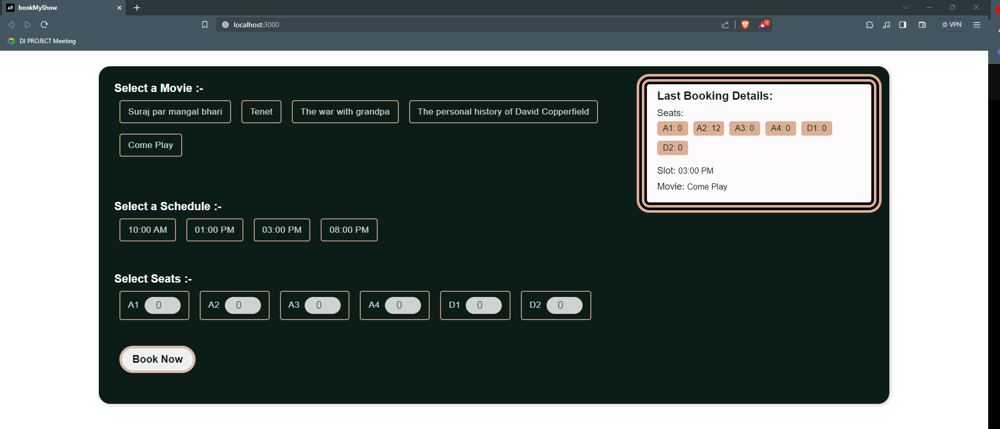

## Alma BETTER  BACKEND PROJECT

# Book My Show
## Group Avalanche

[](https://travis-ci.org/joemccann/dillinger)


## Description

- BookMyShow website is basically for entertainment and knowledge purpose. 
- In this app, a user can book movie ticket by choosing the diiferent timing and movies accordingly

- ✨Magic ✨the user can select a seat  and  bookthe  show

## Features
- Users choose the date, time and number of tickets they wish to purchase and pay for them online.
- Users can also select the seats they want to book beforehand.

1. Event listings: BookMyShow offers information on a wide range of events, including films, plays, concerts, sporting events, and more.

2. Show timings and seat availability: BookMyShow gives consumers access to show timings and seat availability for the events they're interested in, making it simpler for them to plan their trip.

3. Seat selection: BookMyShow gives users the option to choose their seats from an seats schedules, making it simple to choose the best seats available.

4. Available payment methods: In order to make the booking process as smooth as possible, BookMyShow provides a wide range of payment methods, including credit cards, debit cards, net banking, and mobile wallets.


## Functions assciated with the app
- A user can visit the home page and can see the Movies, schedule timing, schedules of seats etc.
- user can view all the movies and select the movies by clicking on any movie  button on the display screen. 
- User would be able to select the movie they wanted to watch.
- They  can book that particular movie by clicking the Book now button.
- After selecting movie, the user can choose the timing of the movie.
- Now, the user can click on the select schedule of the timing. and can see the preview of their selection. 
- After selecting timing of the movie, the user can select seats.
- At the end, user clicking the book now button. 

## - Instruction  for the Installation or Run the Server / Project. -
## For Backend
All API Details

### Installation
Install the dependencies and devDependencies and start the server.

1. Change the Directory using Follow Command
```bash
cd back-end
```
2. if Node js Package Already Available in Project
```
npm start
```
2. if Project run First time on system use Follow Command
```
npm install
```
```
npm start
```
or
for Install Package in Manually.
```
npm install express body-parser cors dotenv mongodb mongoose node-serialize
```

# Usage
## Run Server

```
npm start
```
or
```
node ./index.js
```
## API TABLE
                            
| Method | URL                               | Parameters                                            |
|--------|-----------------------------------|-------------------------------------------------------|
| GET    | http://localhost:8080/api/booking | 
| POST   | http://localhost:8080/api/booking      |                                                   |


# For Frontend
All API Details

### Installation

1. Change the Directory using follow Command
```bash
cd front-end
```
2.  if Node js Package Already Available in Project
```
npm start
```

2. if Project run First time on system use Follow Command
```
npm install
```
```
npm start
```

### or 
for Install Package in Manually.
```
npm install react react-scripts react-dom web-vitals caniuse-lite @testing-library/jest-dom @testing-library/react @testing-library/user-event
```
Usage
## Run Web Server

```
npm start
```
or
```
npm run
```

### API TABLE
| Method     | URL                                                     | Description     |
|------------|---------------------------------------------------------|-----------------|
| GET / POST |  http://localhost:3000/  | Ticket Bookings |

## UI Screen Short


## Contributing By
### 1. Ajay Wagh
### 2. Janvi Singh
### 3. Gayatri Patil

## License 
### Massachusetts Institute of Technology (MIT) License.

